# Long Document Processing System

A production-ready Python system for processing and analyzing long documents with Qdrant vector database integration and AI-powered agents.

## 🚀 Features

- **Smart Document Processing**: Advanced chunking and embedding generation API from Pythera
- **AI Agents**: Document Read and Write agents with RAG capabilities
- **Vector Database**: Qdrant integration for efficient similarity search
- **Scalable Architecture**: Base class patterns for easy extension
- **Production Ready**: Comprehensive error handling, logging, and monitoring

## 📋 Requirements

- Python 3.10+
- Docker and Docker Compose
- OpenAI API key (or compatible API)
- Access to chunking and embedding Pythera APIs

## 🛠️ Installation

1. **Clone the repository**
   ```bash
   git clone https://github.com/trungthanhnguyenn/longdoc.git
   cd longdoc
   ```

2. **Install dependencies**
   ```bash
   pip install -r requirements.txt
   ```

3. **Set up environment variables**
   ```bash
   cp env.example .env
   # Edit .env with your configuration
   ```

4. **Start Qdrant database**
   ```bash
   docker-compose up -d
   ```

## 🔧 Configuration

Copy `env.example` to `.env` and configure the following:

### Required Variables
- `OPENAI_API_KEY`: Your OpenAI API key
- `CHUNKING_API_URL`: URL for chunking API
- `API_URL`: Base API URL
- `EMBEDDING_API_URL`: URL for embedding API

### Optional Variables
- `QDRANT_HOST`: Qdrant server host (default: localhost)
- `QDRANT_PORT`: Qdrant server port (default: 1203)
- `VECTOR_SIZE`: Embedding vector size (default: 768)
- `BATCH_SIZE`: Processing batch size (default: 100)

## 📖 Usage

### Basic Usage

```python
from src.qdrant import QdrantManager, QdrantConfig
from src.agent import DocumentReadAgent, DocumentWriteAgent
from src.config.config import LLMAgentConfig

# Initialize configurations
qdrant_config = QdrantConfig.from_env()
llm_config = LLMAgentConfig.from_env()

# Initialize managers and agents
qdrant_manager = QdrantManager(qdrant_config)
read_agent = DocumentReadAgent(llm_config, qdrant_config=qdrant_config)
write_agent = DocumentWriteAgent(llm_config, qdrant_config=qdrant_config)

# Process a document
result = read_agent.process_document_in_chunks(
    large_chunks=document_chunks,
    document_id="doc_001",
    document_title="My Document"
)
```

### Command Line Usage

```bash
# Process a single document
python main.py path/to/document.txt

# Process different document types
python main.py path/to/document.docx
```

## 🏗️ Architecture

### Processing Pipeline



```mermaid
graph TD
    A[Input Document] --> B[Load & Preprocess]
    B --> C[Semantic Chunking]
    C --> D{Collection Exists?}
    D -->|No| E[Create Qdrant Collection]
    E --> F[Generate Embeddings]
    F --> G[Store in Qdrant]
    D -->|Yes| H[Skip Embedding]
    G --> I[Create Batches ≤5k chars]
    H --> I
    I --> J[Read Agent Analysis]
    J --> K[Update Skeleton]
    K --> L{More Batches?}
    L -->|Yes| J
    L -->|No| M[Write Agent RAG]
    M --> N[Search Qdrant]
    N --> O[Rerank Results]
    O --> P[Generate Content]
    P --> Q[Final Report]
    
    style A fill:#e1f5fe
    style Q fill:#c8e6c9
    style G fill:#fff3e0
    style M fill:#f3e5f5
```

### Core Components

1. **Base Classes** (`src/base/`)
   - `BaseModelConfig`: Abstract configuration with environment loading
   - `BaseModelManager`: Abstract manager with retry logic and health checks

2. **Qdrant Integration** (`src/qdrant/`)
   - `QdrantManager`: High-level document operations
   - `QdrantClient`: Enhanced client with retry logic
   - `DocumentMetadata`: Structured metadata for document chunks

3. **AI Agents** (`src/agent/`)
   - `DocumentReadAgent`: Analyzes documents to create structured frameworks
   - `DocumentWriteAgent`: Generates content using RAG

4. **Document Processing** (`src/documents/`)
   - `Chunking`: Smart chunking with API integration
   - `Embedding`: Vector embedding generation
   - `Preprocess`: Document loading and text extraction

### Processing Pipeline

1. **Document Loading**: Load and preprocess documents
2. **Semantic Chunking**: Create intelligent chunks based on content
3. **Embedding Generation**: Convert chunks to vector embeddings
4. **Vector Storage**: Store embeddings in Qdrant with metadata
5. **Read Agent Analysis**: Create structured report frameworks
6. **Write Agent Generation**: Generate content using RAG

## 📊 Examples

See the `examples/` directory for detailed usage examples:

- `agent_usage_example.py`: Complete agent workflow
- `basic_usage.py`: Simple Qdrant operations
- `document_processing.py`: Document processing pipeline

## 🧪 Testing

```bash
# Run tests (when implemented)
python -m pytest

# Run with coverage
python -m pytest --cov=src
```

## 📝 API Documentation

### DocumentReadAgent

```python
# Process large document chunks (~5k characters)
skeleton = read_agent.process_document_in_chunks(
    large_chunks=chunks,
    document_id="doc_001",
    document_title="Annual Report"
)
```

### DocumentWriteAgent

```python
# Generate complete report from skeleton
report = write_agent.write_complete_report(
    skeleton=skeleton,
    collection_name="my_collection",
    context_limit=5
)
```

### QdrantManager

```python
# Add documents to vector database
success = qdrant_manager.add_document(
    embeddings=embedding_vectors,
    metadata=metadata_list,
    texts=chunk_texts
)

# Search for similar documents
results = qdrant_manager.search_similar(
    query_vector=query_embedding,
    limit=10
)
```

## 🔍 Monitoring

### Health Checks

```python
# Check Qdrant connection
is_healthy = qdrant_manager.health_check()

# Get collection statistics
stats = qdrant_manager.get_collection_stats()
```

### Logging

The system includes comprehensive logging for debugging and monitoring:

- Document processing steps
- API call performance
- Error tracking and recovery
- Resource usage statistics

## 🚨 Troubleshooting

### Common Issues

1. **Qdrant Connection Issues**
   - Ensure Docker is running: `docker-compose up -d`
   - Check port availability: `docker-compose ps`

2. **API Rate Limits**
   - Monitor API usage and implement backoff
   - Check timeout settings in configuration

3. **Memory Issues**
   - Reduce batch size in configuration
   - Monitor system resources during processing

### Debug Mode

Enable debug logging by setting `DEBUG=True` in your `.env` file.

## 🤝 Contributing

1. Fork the repository
2. Create a feature branch
3. Make your changes
4. Add tests for new functionality
5. Submit a pull request

### Development Setup

```bash
# Install development dependencies
pip install -r requirements-dev.txt

# Run linting
black src/
flake8 src/

# Run tests
python -m pytest
```

## 📄 License

This project is licensed under the MIT License - see the LICENSE file for details.

## 🙏 Acknowledgments

- Qdrant Team for the excellent vector database
- OpenAI for powerful language models
- LangChain community for LLM orchestration tools

## 📞 Support

For issues and questions:
- Create an issue on GitHub
